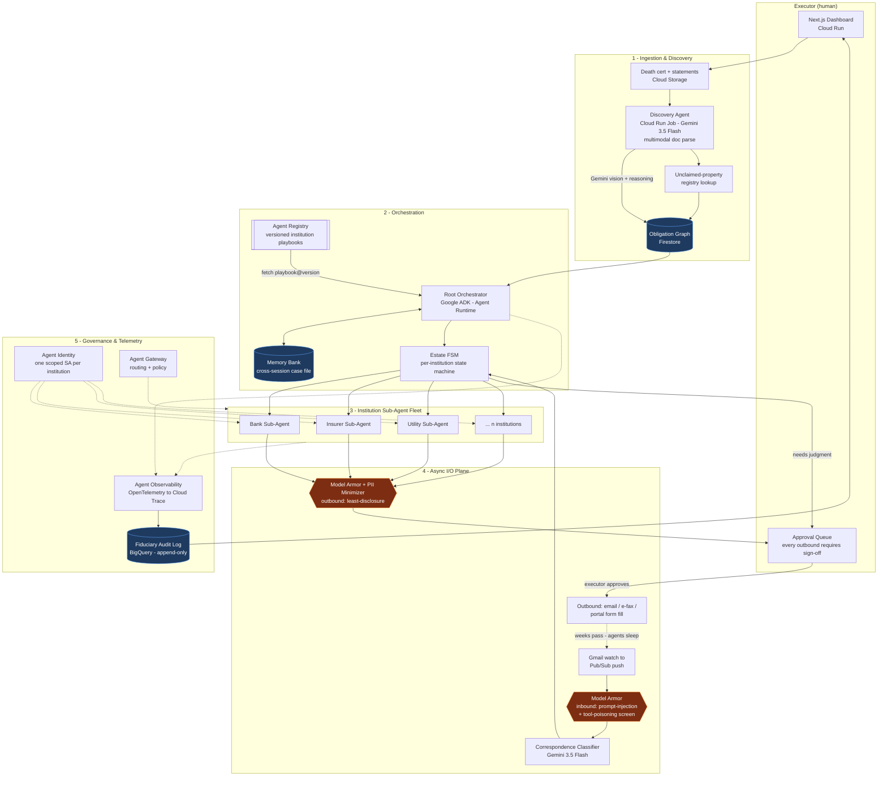

# Aftercare - Architecture

> An autonomous estate-administration agent. The executor uploads a death certificate;
> Aftercare discovers every institution the deceased had a relationship with, then runs a
> per-institution sub-agent for weeks - sleeping, waking on inbound mail, adapting, and
> escalating to the human whenever judgment is required.

---

## 1. System diagram

Paste this into <https://mermaid.live>, export PNG at 2x, and submit that as the
architecture diagram. Keep this source file in the repo - judges like seeing the diagram
is version-controlled, not drawn once in Figma.



---

## 2. The five planes, and why each exists

### Plane 1 - Ingestion & Discovery

The executor uploads a death certificate plus 12 months of statements (PDF, or phone
photos of physical mail). A Cloud Run **Job** - not a service, this is a one-shot batch -
runs Gemini 3.5 Flash in multimodal mode over the corpus and reconstructs the
**obligation graph**: every institution with a live relationship to the deceased, inferred
from recurring debits, letterheads, policy numbers, and account footers.

This is the demo's first wow moment, and it must be genuinely surprising: the agent finds
institutions the family did not list. Cross-reference state unclaimed-property registries
by name + last-known address for the "$4,200 you didn't know about" beat.

**Output contract:** a normalized `Obligation` document per institution - issuer, type,
account fingerprint (never full number), confidence score, evidence pointers back to the
source page.

Implementation: `services/discovery/`. The inference-only discoveries in the seeded estate
come from `services/discovery/inference.py`, which reasons over recurring-debit patterns
rather than letterheads - a recurring monthly debit with no matching statement in the
corpus is a live relationship nobody listed.

### Plane 2 - Orchestration

An ADK root agent reads the obligation graph and, for each node, pulls the matching
**playbook** from Agent Registry. A playbook is a versioned YAML artifact describing one
institution's closure process: required documents, submission channel, department
address, typical SLA, known follow-up demands, escalation triggers.

**This is the core reuse argument and the strongest thing in your submission.** Once a
bank's playbook is encoded, every future estate reuses it. That is what "cataloged for
cross-department use" actually means - not a directory listing, a compounding asset.

Per-institution state lives in an explicit finite state machine, not in the model's head:

```
DISCOVERED -> PACKET_DRAFTED -> AWAITING_APPROVAL -> SENT -> AWAITING_RESPONSE
           -> INFO_REQUESTED -> ESCALATED -> CLOSED
```

Judges reward legible state; a model asked to "remember where we are" is a brittle script
wearing an agent costume.

Implementation: `packages/core/fsm.py` holds the transition table and refuses any
transition not declared in it. `services/orchestrator/` walks the graph.

### Plane 3 - Sub-Agent Fleet

Each institution gets its own agent instance on Agent Runtime, holding no CPU while
dormant. Memory Bank carries the case file across the multi-week gap: what was sent, on
what date, what came back, what the institution demanded that the playbook did not
anticipate. When a sub-agent hits an unanticipated demand it **amends the playbook and
proposes a new version to the Registry** - the fleet gets smarter across estates.

Implementation: `services/worker/`. Amendment proposals land in
`packages/playbooks/publisher.py` as a semver minor bump carrying a diff the executor
reviews.

### Plane 4 - Async I/O

Gmail `watch` pushes to Pub/Sub. Every inbound message is **untrusted third-party
content**, which is the honest, non-decorative justification for Model Armor: a scanned
letter is an injection vector. Screen inbound, then classify (acknowledgement / document
request / rejection / completion / irrelevant) and route back into the FSM.

Outbound runs the reverse: a **PII minimizer** enforces least-disclosure per recipient.
The pension fund legitimately needs the full death certificate. The magazine subscription
gets a name, a date, and nothing else. Show this diff on screen in the demo.

Implementation: `services/inbox/` + `packages/guardrails/`. The screen runs **before** any
model sees the body; the classifier receives a sanitized, delimiter-fenced projection of
the text, never the raw bytes.

### Plane 5 - Governance & Telemetry

Executors carry fiduciary duty and can be sued. So the OpenTelemetry trace here is not
ops garnish - it is a **legal artifact**: an append-only, timestamped record of every
action taken on the estate's behalf and the reasoning chain behind it, queryable in
BigQuery and exportable as a document the executor could hand to a probate court. Say the
words "fiduciary duty" in the video.

Agent Identity issues one narrowly-scoped service account per institution sub-agent, so a
compromised utility agent cannot touch the brokerage credentials.

Implementation: `packages/core/audit/`. Records are hash-chained - each carries the digest
of its predecessor - so tampering with the middle of the log is detectable. That is what
makes it court-defensible rather than merely append-only by convention.

---

## 3. Non-negotiable safety boundaries

State these on screen in the demo. They convert your biggest risk into evidence of
engineering maturity.

1. The agent **never signs anything** and never asserts legal authority.
2. The agent **never makes a legal determination** (who inherits, whether a claim is valid).
3. **Every outbound communication requires executor approval.** No exceptions, no
   auto-send tier, not even for "low-risk" recipients.
4. Ambiguity **escalates within one turn**, with a one-paragraph brief - never guesses.
5. All demo data is a **fictional decedent** with fabricated documents. Say so on screen.

Boundaries 1, 2 and 4 are enforced at runtime in `packages/guardrails/policy.py`;
boundary 3 is enforced structurally - the send path is unreachable without an approval
record - and proved by `tests/test_policy.py`.

---

## 4. Tech stack

| Layer | Choice | Why |
|---|---|---|
| Model | Gemini 3.5 Flash (Vertex AI) | Required; Flash-first keeps spend near zero. Escalate to Pro only for final closure-packet reasoning. |
| Agent framework | Google ADK (Python) | Required; best sub-agent + tool ergonomics. |
| Long-running execution | Agent Runtime - *fallback:* Cloud Run Jobs + Cloud Tasks | Fallback is a one-file swap behind `runtime.py`. |
| Cross-session memory | Memory Bank - *fallback:* Firestore + Vertex Vector Search | Same adapter pattern. |
| Discovery / catalog | Agent Registry - *fallback:* GCS-versioned YAML + Firestore index | Fallback still demonstrates versioning and discovery. |
| Guardrails | Model Armor - *fallback:* Gemini-based injection classifier + DLP API | DLP API alone gives you a credible PII story. |
| Eventing | Pub/Sub (Gmail push, inter-agent) | Required infra service; genuinely needed here. |
| State | Firestore | FSM documents, obligation graph, approval queue. |
| Blobs | Cloud Storage | Uploads, generated packets, outbound PDFs. |
| Audit | BigQuery (append-only sink) | Court-defensible query surface. |
| Tracing | OpenTelemetry to Cloud Trace | Track requirement, and it's real here. |
| API | FastAPI on Cloud Run | Fast, typed, scales to zero. |
| Frontend | Next.js 15 + Tailwind on Cloud Run | Obligation graph view, approval queue, audit timeline. |
| Secrets | Secret Manager | Never in env files; judges check. |
| IaC | Terraform | "Reproducible setup" is 30% of your grade. |

**Adapter discipline:** every GEAP component is accessed only through
`packages/core/adapters/`. If a service turns out to be unavailable, waitlisted, or has a
different API surface than expected, you change one file and keep shipping. Do not let a
Google product page block your build on day 6.

Each adapter module exposes a `get_*_adapter()` factory that reads one env var and returns
either the GEAP implementation or the fallback. Call sites never branch on mode.

---

## 5. Demo architecture: the time-warp

Your agent's whole value is that it operates for six weeks. Your video is four minutes.
Resolve this honestly:

`demo/timewarp.py` injects a **scripted corpus of realistic inbound correspondence**
(including adversarial letters with embedded injections) into the *real* event bus on an
accelerated clock. Every code path is production. Only the calendar is compressed. Put a
visible clock in the UI showing simulated date advancing, and say in the voiceover:
*"Six weeks of real inbound mail, replayed through the live pipeline at 400x."*

Judges punish faked demos and reward this. Do not stub the pipeline.

The simulated clock is `packages/core/clock.py`. Application code never calls
`datetime.now()` directly - services take the clock as a dependency, which is what makes
the time-warp real rather than cosmetic. `tests/test_policy.py` enforces that too.

---

## 6. What runs where

| Component | Local mode | Cloud mode |
|---|---|---|
| Document store | `.aftercare/store/*.json` | Firestore Native |
| Event bus | in-process queue, same handlers | Pub/Sub push to Cloud Run |
| LLM | deterministic offline planner | Vertex AI Gemini 3.5 Flash/Pro |
| Blob store | `.aftercare/blobs/` | Cloud Storage |
| Audit sink | `.aftercare/audit.jsonl`, hash-chained | BigQuery append-only + JSONL mirror |
| Traces | in-memory span recorder, dumped to JSON | OpenTelemetry to Cloud Trace |
| Guardrails | pattern + heuristic screen | Model Armor, or DLP + Gemini classifier |

The handlers are the same objects in both modes. Local mode swaps the edges of the system,
never the middle - which is the only way a local smoke test tells you anything true about
the deployed one.
